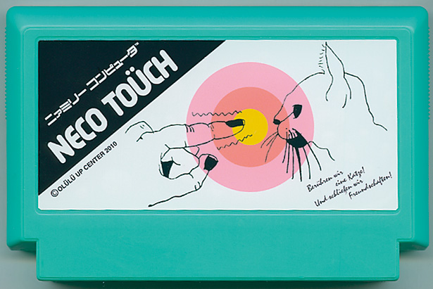

# NECO TOUCH

[Play the game](https://booniepepper.itch.io/neco-touch)

---

Touch the kitty! ("Neko" or "neco" is Japanese for cat)

Touch by matching the cursor with the same colored area of the target. Sounds simple, but things might get crazy.

Note: You may need to turn off blue-light filters to play the game. The target has yellow/orange/purple sections.

Controls:

* Space bar (or z, x, or c): Select player. Touch neco
* Arrow keys (←↑↓→): Change player. (After unlocked) Change direction

Scoring:

Hits gain you LOTSA points, misses lose points, and points run out over time. Zero points loses the game, and all the points wins the game.

I'm posting this to itch.io about 13 years after I made it, and I don't remember the exact scoring system.

---

Created in 2010 for the first A Game by Its Cover (AGBIC) game jam: https://forums.tigsource.com/index.php?topic=13451.0

The inspiration comes from this fantasy Famicom case art created by Olulu for the My Famicase Exhibition 2010

Some articles from the time:

    https://technabob.com/blog/2010/08/13/famicase-games/
    http://www.digital-tools-blog.com/games/2659-neco-touch
    https://www.inside-games.jp/article/2010/08/15/43760.html
    https://web.archive.org/web/20100818165622/http://www.bytejacker.com/blog/neco-touch-the-best-game-about-cat-poking-youll-play-all-day​

---

Provided for free, donations unnecessary

2010 J.R. Hill

